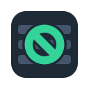
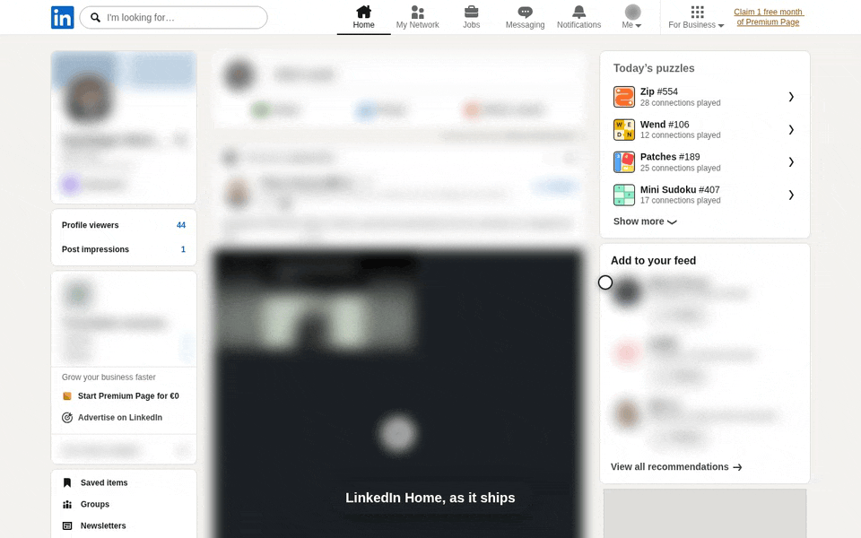
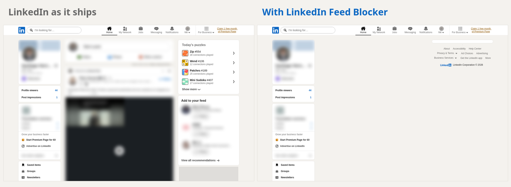
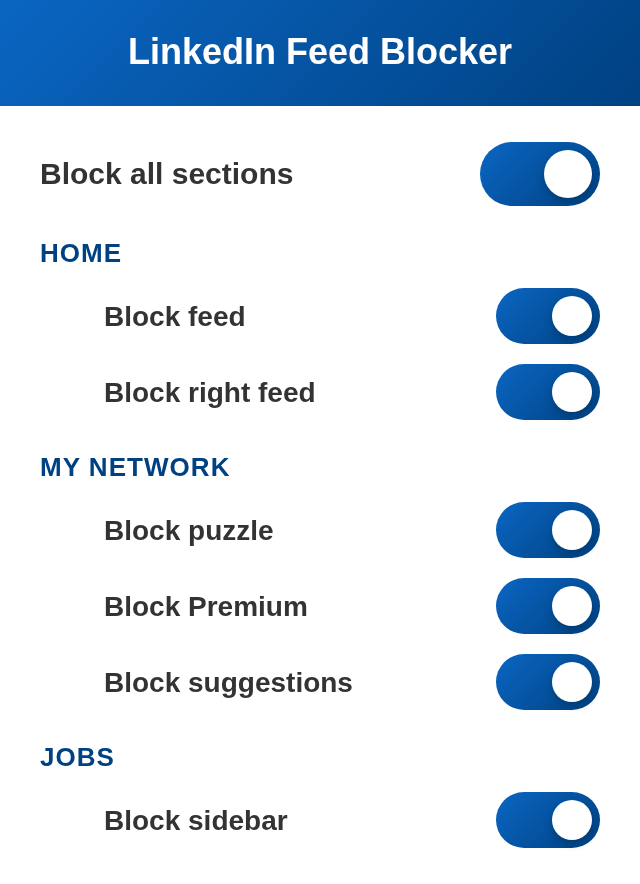

# LinkedIn Feed Blocker

Hide LinkedIn's Home feed, the widgets beside it, the My Network puzzles,
Premium upsells and people suggestions, and the red dots that call you back to
the top bar. Your invitations, jobs, messages, search, and profiles stay where
they are.

## Before and after

Names, faces, and posts in these captures are blurred on purpose. They belong
to real people.

## What gets blocked

| Page            | Hidden                                             | Left alone                      |
| --------------- | -------------------------------------------------- | ------------------------------- |
| **Top bar**     | The red dots on Home and Notifications, and the Premium upsell link | Every nav item, and the Messaging dot |
| **Home**        | The feed, the post composer above it, and the puzzles, follow suggestions and ads in the right rail | Your profile card and the nav bar |
| **My Network**  | The daily puzzle, the Premium upsell, and every suggestion module | Your pending invitations |
| **Job posting** | The Premium upsell and "Post a job" promo in the sidebar | The job itself, and applying |

The top bar row applies everywhere, since the top bar is everywhere. Every other
LinkedIn page is untouched. Each row has its own switch, and turning one off
puts back exactly what was there.

## Two ways to flip a switch

<table>
  <tr>
    <td width="320" valign="top">
      
    </td>
    <td valign="top">

**The popup.** One switch for everything, and one per section, grouped by page.

**The keyboard.** <kbd>Ctrl</kbd> + <kbd>Shift</kbd> + <kbd>7</kbd> toggles the
page you are on (<kbd>⌘</kbd> + <kbd>Shift</kbd> + <kbd>7</kbd> on macOS).
Rebind it at `chrome://extensions/shortcuts`, or from the gear menu in Firefox's
`about:addons`, and the extension follows the new keys.

</td>
  </tr>
</table>

## Privacy

Your settings stay in the browser's local extension storage. The extension
makes no network requests, runs no backend, and asks only for `storage`,
`activeTab`, and access to `linkedin.com`. The Firefox build declares that it
collects no data.

## Status

Version 0.3.1 works in Chrome, Chromium, Firefox, and Zen. LinkedIn changes its
markup often, and when it does a section can reappear until the extension
catches up. If something LinkedIn shows you should be blocked and isn't, or the
other way round, [open an issue](https://github.com/shbernal/linkedin-feed-blocker/issues).

To build it yourself or send a change, start at
[CONTRIBUTING.md](CONTRIBUTING.md).

LinkedIn is a trademark of LinkedIn Corporation. This project is not affiliated
with or endorsed by LinkedIn.

## License

[MIT](LICENSE)
